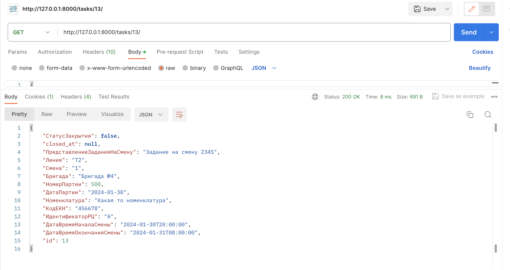

# Система контроля заданий на выпуск продукции #

## Стек технологий ##
+ SQLAlchemy
+ fastapi

## Как запустить проект
Клонируйте репозиторий и перейдите в него в командной строке:
```
git@github.com:Mary8jk/test-task-axon.git
```

```
cd test-task-axon
```

Создайте env-file:
```python
touch .env
```

Добавьте в env-file данные:
```python
DB_HOST=localhost
DB_PORT=5432
DB_USER=postgres
DB_PASS=postgres
DB_NAME=postgres
```

Cоздайте и активируйте виртуальное окружение:

```
python3 -m venv venv
```

```
source venv/bin/activate
```

Установите зависимости из файла requirements.txt:

```
python3 -m pip install --upgrade pip
```

```
pip install -r requirements.txt
```


для запуска БД Posgres в отдельном окне терминала:
```
pg_ctl -D <путь_к_папке_с_базой_данных> start
```

создаем роль в бд:
```
createuser --interactive --pwprompt postgres
```

запускаем psql:
```
psql -h localhost -p 5432 -U postgres
```

(для миграций (в проекте они уже сформированы, эта информация для справки)

инициализируем миграции:
```
alembic init migrations
```

в файле env.py добавляем импорты и конфиг:
```
from config import settings
from models import TaskModel
from database import Base
```

```
if config.config_file_name is not None:
    fileConfig(config.config_file_name)

config.set_main_option('sqlalchemy.url', str(settings.DATABASE_URL_psycopg))

target_metadata = Base.metadata
```

делаем ревизию миграций:
```
alembic revision --autogenerate
```

запускаем миграции:
```
alembic upgrade head
```
)

для запуска проекта из директории /app:
```
uvicorn main:app --reload
```

Документация: <http://127.0.0.1:8000/docs#/>
Redoc: <http://127.0.0.1:8000/redoc>


## В ходе разработки реализовано: ##
- Эндпойнт добавления сменных заданий: "/tasks/"


- Эндпойнт получения сменного задания (партии) по ID (``primary key``): "/tasks/{task_id}"

- Эндпойнт изменения сменного задания (партии) по ID (``primary key``): "/tasks/{task_id}"


- Эндпойнт получения сменных заданий по различным фильтрам:
+ "/tasks/?status=true" - фильтрация по статусу
+ "/tasks/?batch_number=123" - фильтрация по номеру партии
+ "/tasks/?batch_date_from=2024-01-01&batch_date_to=2024-12-31" - фильтрация по диапазону дат партии

- Эндпойнт добавления продукции для сменного задания (партии): "/add_product/"


- Эндпойнт "аггрегации" продукции: "/aggregate_product/{batch_id}/{unique_code}"
